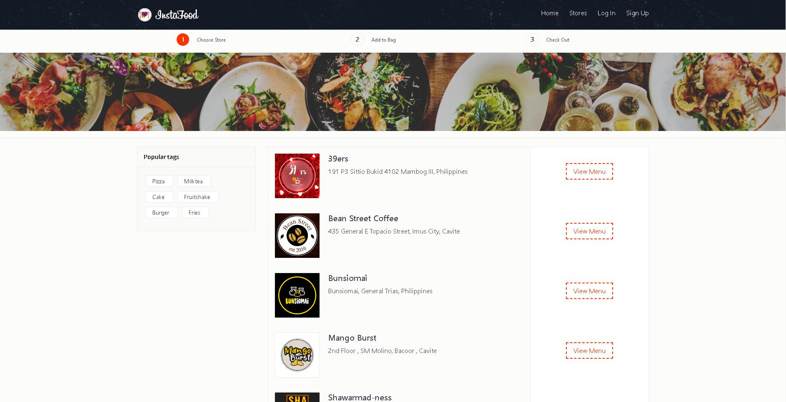
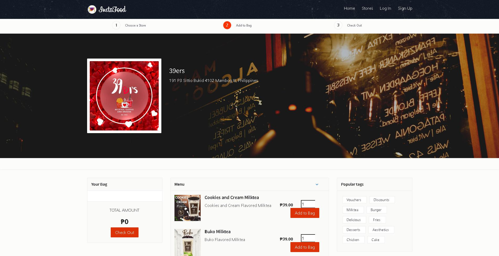
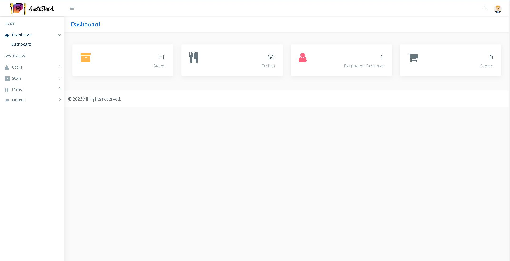

# InstaFood Online Ordering System

 $\color{Pink}\textsf{\Large\kern{0.2cm}\normalsize In compliance to  DCIT24 - Information Technology}$ 

## Co-Authors
- [izana92](https://www.github.com/izana92)
- [JapsSwain](https://www.github.com/JapsSwain)
- [KARENLUMONGSUD](https://www.github.com/KARENLUMONGSUD)

## Preview
### Homepage

### List of Stores

### List of Menu

### Admin Dashboard

### Languages Used
- PHP
- SQL
- BOOTSTRAP 4
- AJAX
- JQUERY

## Usage
#### Requires:
- Xamp/Wamp/Mamp/Lamp

Prepare the Database in XAMP located in:
`SQL/online_rest.sql`

Default User Account:
- Username: `user1`
- Password: `usertester123`

To access admin portal
- Type in the URL bar `root/admin/`

> Note: Root is your Root Directory example: `localhost/InstaFood-Ordering-System/admin`

Default Admin Account:
- Username: `admin`
- Password: `admin123`

>Note: Make sure that the XAMP is turned on when you are using the system

